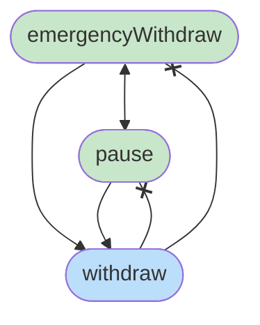

[](https://www.gnu.org/licenses/gpl-3.0)

Elser is a domain-specific language (DSL) for smart-contract development. It emphasizes explicitness for critical and mutative operations and enforces a structured approach to smart-contract building. It compiles to EVM bytecode via Yul as an intermediate representation, leveraging `solc` for optimization and final bytecode generation.

**ELSER** stands for ***E**xplicit **L**isp-like **S**mart-contract language with **E**nforced structure and **R**estrictness*.

> **NOTE:** Elser is in alpha and not yet suitable for production use.

# Table of Contents
- [Quickstart](#quickstart)
- [Background](#background-and-motivation)
- [Program Layout](#program-layout)
  - [Storage Variables](#storage-variables)
  - [Functions](#functions)
  - [Constants](#constants)
  - [Events](#events)
  - [Types](#types)
- [REPL](#repl)
- [Tutorial](#tutorial)

## Quickstart
### Prerequisites
- [Java 8+](https://www.java.com/en/download/manual.jsp) (required for Clojure)
- [Clojure](https://clojure.org/guides/install_clojure)
- [Leiningen](https://leiningen.org/#install)
- [Solidity 0.8.18+](https://docs.soliditylang.org/en/latest/installing-solidity.html) (required to compile Yul to EVM bytecode)

### Getting Started
```sh
## Clone the repo.
git clone https://github.com/elser-lang/elser

## Build the JAR
lein uberjar

## 1. Launch (elser -> Yul) REPL
java -jar target/uberjar/elser-0.0.1-alpha-standalone.jar
## 2. Check available commands.
java -jar target/uberjar/elser-0.0.1-alpha-standalone.jar --help
## 3. Compile elser program.
java -jar target/uberjar/elser-0.0.1-alpha-standalone.jar -c examples/counter.els
## 4. Generated bytecode & Yul will be saved in '/out' directory
ls out/
```

## Background and Motivation
Elser is a statically‑typed DSL designed around these core principles for safe, predictable smart‑contract development:

### 1. Restrictive Semantics
Contracts must be unambiguous. Elser enforces program structure at the language-level and disallows implicit behavior.

### 2. Immutability by Default
Variables are immutable unless explicitly marked as `mut`. This reduces unintended state changes and makes reasoning about contract logic simpler.

### 3. Explicit Mutations & Control Flow
Every state‑modifying operation (e.g. storage reads/writes) and flow control construct must be spelled out in the source.

### 4. Explicit Permissions for Storage Access
Every function is required to contain a storage-permissions attribute that specifies allowed storage operations.

## Program Layout
Elser programs require **fixed program layout**:
- Namespace definition inside `(ns )` block (aka contract's name).
- All storage variables are grouped inside `(storage {})` block.
- All functions are grouped inside `(functions {})` block.
- All constants are grouped inside `(constants {})` block.
- All events are grouped inside `(events [])` block.

This structure makes it trivial to navigate code and integrate IDE features.
```clj
(ns <your-ns> (:pragma "0.8.30")) ;; Solc version

(constructor ())

(events [])

(constants
  {:external [(def name_0 [(ret-name :type)]) …]
   :internal [(def name_1 [(ret-name :type)]) …]})

(storage
  {:external [(def var_0 [(ret_name :type)]) …]
   :internal [(def var_1 [(ret_name :type)]) …]})

(functions
  {:external
    [(defn x [(arg_0 [mut] :type) …] (-> [(ret_0 [mut] :type)]) …)
     …]
   :internal
    [(defn y [(arg_1 [mut] :type) …] (-> [(ret_1 [mut] :type)]) …)
     …]})
```
- **`:external`** definitions become part of ABI.
- **`:internal`** definitions are only visible/invokable within the namespace.

### Storage Variables
Every storage variable is put either in `:external` variables set, or in `:internal` variables set.

By default, all storage variables are *mutable* (it's planned to change that https://github.com/elser-lang/elser/issues/20).

Definition syntax looks as follows:
```clj
(def owner [(r :addr)])
```
Since, every storage variable returns some value, it's required to specify a return name for that value. Therefore, every variable acts as a function that takes no arguments and returns some specified value type.
> **NOTE:** Currently return names for storage variables are unused inside the program, and just added to simplify compilation pipeline...
-------
### Functions
Every function is put either in `:external` functions set, or in `:internal` functions set.

Definition syntax looks as follows:
```clj
(defn transfer [(to :addr) (amount :u256)] @sto{:w 1 :r 1} (-> [(ok mut :bool)]))
```

#### Function Parameters
Every function's parameter is immutable by default (e.g., `to` and `amount` can't be mutated), to mutate it inside the function, it's needed to add a special `mut` attribute `(amount mut :u256)`

For instance, if `transfer` function applies fee to the amount and overwrites it, we need to mark `amount` as mutable
```clj
(defn transfer [(to :addr) (amount mut :u256)] @sto{:w 1 :r 1} (-> [(ok mut :bool)])
  (do (...)
      (set! amount (invoke! feeOnTransfer amount))
      (...)))

```

#### Function Permissions
Storage-access attribute `@sto{:w 0 :r 0}` can't be omitted, and should always explicitly specify allowed operations for the function:
- `{:w i}` - permission to write to storage.
- `{:r j}` - permission to read from storage.

Where $i,j \in$ {0,1,2,3}

Function $x$ can invoke function $y$
$$\iff x.w \geq y.w \land x.r \geq y.r$$

In other words, $x$ must have at least as much write and read‑privilege as $y$.

**Example of Multi-Level Permissions**

It can be useful to limit access to certain critical functions withtin a namespace. For example, we can have a `pausableEtherWallet` namespace that will implement ETH-storing wallet and will have pausable functionality.

We create two tiers of functionality:

**1. Core operations (w ∈ {0,1}, r ∈ {0,1})**
```clj
(defn withdraw [(amount :u256)] @sto{:w 0 :r 1} (-> []) ...)
(defn getBalance [] @sto{:w 0 :r 0} (-> [(b mut :u256)]) ...)
```

**2. Critical operations (w = 2, r = 1)**

Pushed to higher level of permissions:
```clj
(defn emergencyWithdraw [] @sto{:w 2 :r 1} (-> []) ...)
(defn pause [] @sto{:w 2 :r 1} (-> []) ...)
```
Attempting to call a level‑2 function from a level‑0 or level‑1 function results in a compile‑time error:
```clj
;; > elser: invalid permissions: fn emergencyWithdraw | have {:r 1, :w 0} | want {:r 1, :w 2}
(defn withdraw [(amount :u256)] @sto{:w 0 :r 1} (-> []) 
  (invoke! emergencyWithdraw))
```

The multi-level privilege relations can be represented via such diagram:


#### Function Returns
Return parameters are also immutable by default, and should be explicitly marked as `mut` to map values to them. All functions should include return syntax, even if they don't return anything:

E.g., `transfer` returns `:bool` on success.
```clj
(defn transfer [(to :addr) (amount :u256)] @sto{:w 1 :r 1} (-> [(ok mut :bool)])
  (do (...)
      (-> ok true))) ;; map TRUE to `ok`
```
While `withdraw` function from `WETH` contract doesn't return anything, but still requires to specify "void" return.
```clj
(defn withdraw [(wad :u256)] @sto{:w 1 :r 1} (-> []))
```

#### Function Body
Functions will contain execution logic - they can interact with other blocks of a namespace `[storage | constants | events]` and invoke function calls. 

Multiple operations inside the body should be executed via `(do ...)` statement (unlike in Lisps `do` in Elser doesn't return anything and just sequentially executes every expression).

Function calls should be invoked via `(invoke! functionName args)` function, therefore every function call inside Elser program can be tracked via `invoke!` keywords.

Storage can be accessed via `(sto read! var) | (sto write! var args)` function. Therefore, every storage interaction is easily trackable as well.
```clj
    ;; This function requires read access to storage, since it invokes `_checkOwner`
    ;; that read from storage.
    ;; And it requires write access, since invoked `_transferOwnership` will
    ;; write to `owner` storage variable.
   (defn transferOwnership [(newOwner :addr)] @sto{:w 1 :r 1} (-> [])
     (do
       (invoke! _checkOwner) ; like `_checkOwner()`
       (assert (!= newOwner ADDRESS_ZERO))
       (invoke! _transferOwnership newOwner))) ; like `_transferOwnership(newOwner)`

   (defn _checkOwner [] @sto{:w 0 :r 1} (-> [])
     (require (= (caller) (sto read! owner)) ERR_NOT_OWNER))

   (defn _transferOwnership [(newOwner :addr)] @sto{:w 1 :r 1} (-> [])
     (let [oldOwner (sto read! owner)]
       (do
         (sto write! owner newOwner) ; like `owner = newOwner`
         (emit! OwnershipTransferred [oldOwner newOwner]))))
```

### Constants
Every constant is put either in `:external` constants set, or in `:internal` constants set.

Constants are defined just like storage variables, but they also require to have a value assigned to them (FYI, types aren't checked there yet: https://github.com/elser-lang/elser/issues/9).
```clj
(def SUPPLY [(s :u256)] 10000000000000000000000000000)
```

To access constant inside a function it's needed to refer it by its name:
```clj
(def setSupply [] @sto{:w 1 :r 0} (-> [])
  (sto write! totalSupply SUPPLY))
```

### Events
Events are stored in one set with all events, and defined as:
```clj
(def OwnershipTransferred [(prevOwner :addr) (newOwner :addr)])
```
Their parameters don't need `mut` attribute. Currently in generated `Yul` code events are emitted as `LOG0`, thus there are no `indexed` parameters (https://github.com/elser-lang/elser/issues/7).

### Types
Dynamic typing is discouraged as it might lead to unpredictable runtime errors. Though, it's planned to support `(map)` as only dynamic type, and to support fixed-sized arrays (https://github.com/elser-lang/elser/issues/10).

There are only 256-bits types to restrict variables packing, and prevent casting stuff back-and-forth during code generation.

The list of currently supported types:
```clj
:u256
:bool
:addr
:b32

;; TODO:
:i256
(map ...)
(array [size] ...)
(struct :type_0 ... :type_n)
```

## REPL
Running Elser without arguments will start REPL that provides `read -> compile (to Yul) -> print` pipeline.


## Tutorial
Let's create basic `counter` contract.
[An example Solidity program will look like this](https://solidity-by-example.org/first-app/):
```solidity
// SPDX-License-Identifier: MIT
pragma solidity ^0.8.26;

contract Counter {
    uint256 public count;

    // Function to get the current count
    function get() public view returns (uint256) {
        return count;
    }

    // Function to increment count by 1
    function inc() public {
        count += 1;
    }

    // Function to decrement count by 1
    function dec() public {
        // This function will fail if count = 0
        count -= 1;
    }
}
```

### 1. Creating Elser program
Firstly, we'll create a `.els` file that will store all the code:
```sh
touch counter.els
```

### 2. Defining Namespace and Storage
Now, we'll define a namespace and will place storage variables inside `storage` block:
```clj
(ns counter (:pragma "0.8.26"))

(storage
  {:external
    [ (def count [(r :u256)]) ]}) ; = uint256 public count;
```

### 3. Defining Functions
Next, we'll store the main logic in functions:
```clj
(ns counter (:pragma "0.8.30"))

(storage
  {:external
    [ (def count [(r :u256)]) ]}) ; = uint256 public count;

(functions
  ;; All required functions are public in Solidity, so we put them in :external block.
  {:external
    [ ;; This function needs to read storage so we set {:r 1}
    (defn get [] @sto{:w 0 :r 1} (-> [(c mut :u256)])  ; function get() public view returns (uint256)
        (-> c (sto read! count))) ; return count;
  
     (defn inc [] @sto{:w 1 :r 1} (-> []) ; function inc() public
       (let [c (sto read! count)] ; store `count` in memory.
         (sto write! count (+ c 1)))) ; count += 1;

     (defn dec [] @sto{:w 1 :r 1} (-> []) ; function dec() public
       (let [c (sto read! count)] ; store `count` in memory.
         (sto write! count (- c 1)))) ; count -= 1;
  ]})
```

### 4. Compiling Contract
Now, when we have everything we can compile `counter.els`:
```sh
java -jar target/uberjar/elser-0.0.1-alpha-standalone.jar --compile counter.els
```
It will produce `counter.yul & counter.bytecode` files in `/out` folder (note, currently `.yul` file stores unoptimized Yul code: https://github.com/elser-lang/elser/issues/13).

### 5. Interacting with the Contract
#### 5.1 Remix IDE
The simplest way to interact with the compiled contract is to use [Remix IDE](https://remix.ethereum.org/#optimize=true&version=soljson-v0.4.24+commit.e67f0147.js&lang=en&runs=200&evmVersion=null&language=Solidity).

##### - Copy `counter.yul` inside `/contracts` folder


##### - Set compiler version to the one specified in `:pragma`, and set language to `Yul`.


##### - Compile and Deploy contract.
##### - You can interact with it via `Low level interactions`:

